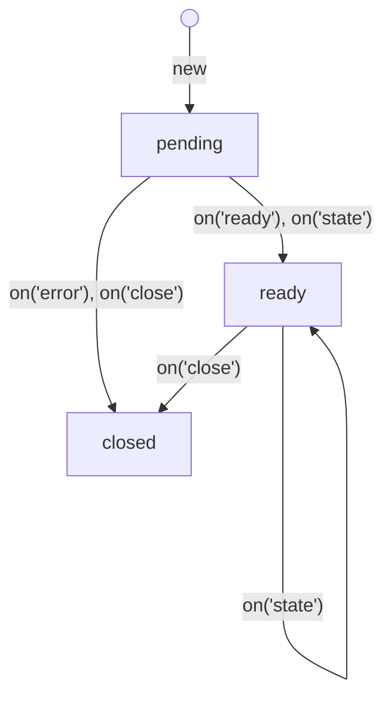
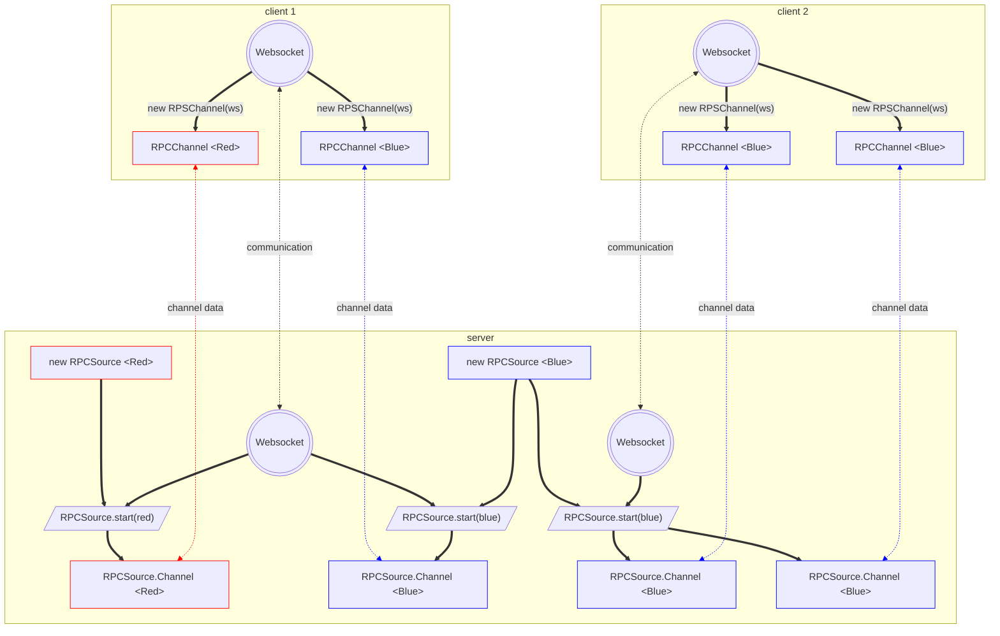

# @flinbein/stateful-rpc

A lightweight TypeScript library for type-safe Remote Procedure Calls (RPC) with built-in state management. This library facilitates communication between client and server with a focus on maintaining state synchronization.

**Features:**
- Type-safe RPC communication
- State synchronization
- Event-based messaging system
- Nested channels support
- Promise-based API
- Based on Proxy for dynamic method handling
- Works with [WebSockets](#using-with-websocket), [MessagePorts](#using-with-sharedworker), and [more](#using-with-other-transports)

## Table of Contents

- [Installation](#installation)
- [Basic Usage](#basic-usage)
- [Channel Lifecycle](#channel-lifecycle)
- [Built-in Events](#built-in-events)
- [Calling Remote Methods](#calling-remote-methods)
- [Working with State](#working-with-state)
- [Nested Channels](#nested-channels)
- [Custom Events](#custom-events)
- [Class-Based RPCSource](#class-based-rpcsource)
- [Context in RPC Methods](#context-in-rpc-methods)
- [Validation](#validation)
- [API Reference](#api-reference)
  - [RPCSource](#class-rpcsource)
  - [RPCChannel](#class-rpcchannel)
  - [RPCSource.Channel](#class-rpcsourcechannel)
  - [Interaction Diagram](#interaction-diagram)
- [Using with WebSocket](#using-with-websocket)
- [Using with SharedWorker](#using-with-sharedworker)
- [Using with Other Transports](#using-with-other-transports)
- [License](#license)

## Installation

### NPM
Run the following command to install the package:
```bash
npm install @flinbein/stateful-rpc
```
### CDN
You can use the library directly in the browser via [CDN](https://www.jsdelivr.com/package/npm/@flinbein/stateful-rpc):
```html
<script type="module">
  import { RPCSource, RPCChannel } from 'https://cdn.jsdelivr.net/npm/@flinbein/stateful-rpc/+esm';
</script>
```

## Basic Usage
The library consists of two main components:
- [RPCSource](#class-rpcsource): The server-side component that defines methods and manages state
- [RPCChannel](#class-rpcchannel): The client-side component that communicates with the RPCSource

Basic example using WebSocket:

Server Side:
```typescript
import RPCSource from '@flinbein/stateful-rpc/source';
import ws from 'ws';

// Create an RPC source with methods
export const calculator = new RPCSource({
  add: (a, b) => a + b,
  subtract: (a, b) => a - b,
  multiply: (a, b) => a * b,
  divide: (a, b) => {
    if (b === 0) throw "Division by zero";
    return a / b;
  }
});

// Create a connection handler for WebSocket
function createConnection(socket) {
  return (send, close) => {
    // Handle incoming messages from the WebSocket
    socket.on("message", (data) => {
      send(...JSON.parse(data.toString()));
    });
  
    // Handle WebSocket closure
    socket.on("close", () => close("Client disconnected"));

    // Return a function to send messages back to the client
    return (...args) => socket.send(JSON.stringify(args));
  };
}

// Create a WebSocket server
const wss = new ws.Server({ port: 8080 });

// Handle WebSocket connections
wss.on('connection', (socket) => {
  // Start the RPC service for this connection
  RPCSource.start(calculator, createConnection(socket));
});
```
Client Side:
```typescript
import RPCChannel from '@flinbein/stateful-rpc/channel';

// Import the type of the server-side RPCSource
import type { calculator } from './server'; 

// Create a connection handler for WebSocket
function createConnection(socket: WebSocket){
  return (send, close) => {
    socket.onmessage = (event) => {
      send(...JSON.parse(event.data));
    };
    
    socket.onclose = () => close('Connection closed');
    
    return (...args) => socket.send(JSON.stringify(args));
  };
}

// Connect to WebSocket server
const socket = new WebSocket('ws://localhost:8080');

// wait for the WebSocket to open before using the RPC channel
await new Promise(resolve => socket.onopen = resolve);

// Create RPC channel
const channel = new RPCChannel<typeof calculator>(createConnection(socket));

const sum = await channel.add(5, 3);
console.log('5 + 3 =', sum); // 8

const product = await channel.multiply(4, 7);
console.log('4 * 7 =', product); // 28

try {
  await channel.divide(10, 0);
} catch (e) {
  console.error('Error:', e); // "Division by zero"
}

channel.close();
```

## Channel Lifecycle

An [RPCChannel](#class-rpcchannel) goes through three states: `pending`, `ready`, and `closed`.


### Pending
The channel is being established.
- `channel.ready` is `false`.
- `channel.closed` is `false`.
- `channel.promise` is pending.
- `channel.state` is `undefined` (not available yet).
- You can use remote methods and nest channels. But they can throw exception if the channel is closed.

### Ready
The channel is established and ready for communication.
- `channel.ready` is `true`.
- `channel.closed` is `false`.
- `channel.promise` is resolved with the channel instance.
- `channel.state` contains the current state from the server.
- You can use remote methods and nest channels.

### Closed
The channel is closed and cannot be used anymore.
- `channel.ready` is `false`.
- `channel.closed` is `true`.
- `channel.promise` is resolved or rejected with the close reason.
- `channel.state` contains the last known state from the server.
- You cannot use remote methods or nest channels.

## Built-in Events
Channels have lifecycle events that you can listen to:

```typescript
const channel = new RPCChannel(messageHandler);

// Listen for channel ready event
channel.on('ready', () => {
  console.log('Channel is ready!');
  console.assert(channel.ready === true);
});

// Listen for channel close event
channel.on('close', (reason) => {
  console.log('Channel closed with reason:', reason);
  console.assert(channel.closed === true);
});

// Listen for channel error event
channel.on('error', (error) => {
  console.error('Channel error:', error);
});

// Wait for channel to be ready
try {
  await channel.promise;
  console.log('Channel is ready!');
} catch (error) {
  console.error('Failed to establish channel:', error);
}
```

## Calling Remote Methods

You can define methods on the server side by passing an object to the [RPCSource](#class-rpcsource) constructor.

These methods should return:
- A value that can be serialized by your transport (e.g., JSON-serializable);
- An instance of [RPCSource](#class-rpcsource) (for opening a [nested channel](#nested-channels));
- A new [RPCSource.Channel](#class-rpcsourcechannel) (for opening a [nested channel](#nested-channels));
- A Promise that resolves to one of the above.

Server side:
```typescript
export const mathService = new RPCSource({
  ping: () => "pong",
  logToServer: (...message) => console.log("Message from client:", ...message),
  math: { // you can nest methods
    square: (x) => x * x,
  },
});

RPCSource.start(mathService, connection);
```

Client side:
```typescript
const channel = new RPCChannel<typeof mathService>(connection);
// call method
console.log(await channel.ping()); // "pong"
// call nested method
console.log(await channel.math.square(5)); // 25
// call method without waiting for a response
channel.logToServer.notify("hello from client"); // void
```


## Working with State

The [RPCSource](#class-rpcsource) maintains a state that clients can access.\
When the state changes, all connected clients are notified.

Server Side:

```typescript
export const counter = new RPCSource({
  increment: () => {
    // Use counter.setState to update the state
    counter.setState((state) => state + 1);
    return counter.state;
  },
  decrement: () => {
    counter.setState((state) => state - 1);
    return counter.state;
  }
}, 0); // Initial state is 0
// on socket connection
RPCSource.start(counter, connection);
```

Client Side:

```typescript
const channel = new RPCChannel<typeof counter>(connection);

// Get the current state
console.log('Current count:', channel.state); // 0

// Listen for state changes
channel.on('state', (newState, oldState) => {
  console.log(`Counter changed from ${oldState} to ${newState}`);
});

// Increment the counter
console.log('New count:', await channel.increment()); // 1
console.log('State is synchronized:', channel.state === 1); // true
```

## Nested Channels

[RPCSource](#class-rpcsource) allows you to create nested channels for more complex applications.\
You can create a method that returns another [RPCSource](#class-rpcsource). When the client calls this method as constructor, a new channel is created.

Server Side:
```typescript
const userSource = new RPCSource({
  updateName: (name) => {
    userSource.setState({ ...userSource.state, name });
    return userSource.state;
  }
}, { name: "Guest", email: "" });

// Create a main source that provides access to the inner source
export const mainService = new RPCSource({
  User: () => userSource
});

// Start the RPC service with the main source
RPCSource.start(mainService, connection);
```

Client Side:

```typescript
// Create the main channel
const mainChannel = new RPCChannel<typeof mainService>(connection);

// Create a nested channel
const userChannel = new mainChannel.User();

// Access the nested channel's state
console.log('User:', userChannel.state); // { name: "Guest", email: "" }

// Update user information
await userChannel.updateName("John Doe");
console.log('Updated user:', userChannel.state); // { name: "John Doe", email: "" }
```

Another way to define nested channels is to use [class-based](#class-based-rpcsource) approach:
```typescript
class User extends RPCSource.with("$", { name: "Guest", email: "" }) {
  updateName(name) {
    this.setState({ ...this.state, name });
    return this.state;
  }
};

export const mainService = new RPCSource({
  User: User // use the class as constructor of nested channel
});

// Start the RPC service with the main source
RPCSource.start(mainService, connection);
```
The difference is that in this case `new mainChannel.User()` will create a new instance of `User` class for each call.

3rd way is to use [RPCSource.Channel](#class-rpcsourcechannel) to create nested channels manually:

```typescript
const userSource = new RPCSource({
	updateName: (name) => {
		userSource.setState({...userSource.state, name});
		return userSource.state;
	}
}, {name: "Guest", email: ""});

// Create a main source that provides access to the inner source
export const mainService = new RPCSource({
	User: () => {
		const channel = new RPCSource.Channel(userSource);
		setTimeout(() => channel.close(), 5000); // auto close after 5 seconds
		return channel;
  }
});
```

## Custom Events

[RPCSource](#class-rpcsource) provides a powerful event system that allows the server to emit events to connected clients.

Server Side:
```typescript
import RPCSource from '@flinbein/stateful-rpc/source';

// Define the event types using TypeScript
export const notificationService = new RPCSource({}).withEventTypes<{
  alive: [aliveSignal: boolean],
  alert: { // you can use nested events
    warning: [message: string, level: number],
    error: [code: string, message: string]
  }
}>();

// Start the RPC service with the main source
RPCSource.start(notificationService, connection);

// Later, emit events to all connected clients
notificationService.emit("alive", true);
notificationService.emit(["alert", "warning"], "System maintenance soon", 2);
notificationService.emit(["alert", "error"], "ERR_001", "Connection lost");

```

Client Side:

```typescript
const channel = new RPCChannel<typeof notificationService>(connection);

// Listen for custom events
channel.on("alive", (aliveSignal) => {
  console.log(`notificationService is alive: ${aliveSignal}`);
});

// Listen for nested events using dot notation
channel.alert.on("warning", (message, level) => {
  console.log(`Warning (level ${level}): ${message}`);
});

// Or use array path for nested events
channel.on(["alert", "error"], (code, message) => {
  console.log(`Error ${code}: ${message}`);
});
```
You cannot use reserved event names as string: `state`, `close`, `error`, `ready`.\
But you can use them as an array path:
```typescript
// server
source.emit(["state"], "custom state event", 123);
// client
channel.on(['state'], (...eventData) => {
  // this is a custom event named "state", not the built-in state event.
  console.log(...eventData); // "custom state event" 123
});
```

## Class-Based RPCSource

You can use class-based approach with method prefixes:

```typescript
// Server-side
class Calculator extends RPCSource.with("$") {
  // Prefix is automatically recognized
  $multiply(this: undefined, a: number, b: number) {
    return a * b;
  }
  
  $divide(this: undefined, a: number, b: number) {
    if (b === 0) throw new Error("Division by zero");
    return a / b;
  }
}

RPCSource.start(new Calculator(), connection);

// Client-side
const calculator = new RPCChannel<Calculator>(connection);
const result = await calculator.multiply(5, 3); // Calls $multiply on the server
```
All methods prefixed with `$` will be exposed as remote methods.

## Context in RPC Methods

You can provide a context object when starting the RPC service:

```typescript
// Server side
const users = new Map();

const userService = new RPCSource({
  // 'this.context' will be the context object (socket)
  setName: function(this: RPCSource, name: string) {
    users.set(this.context, name);
    return true;
  },
  getName: function(this: RPCSource) {
    return users.get(this.context);
  }
});


wss.on('connection', (socket) => {
  // Provide the socket as context
  RPCSource.start(userService, createConnection(socket), {context: socket});
});

// You cannot access the channel from outside the method
userService.context; // throws error
```

## Validation

Method `RPCSource.validate(validator, originFn)` allows you to wrap methods with a validator function.

### Parameters
- `validator`: it takes an array of arguments and returns:
  - `false`: validation fails
  - `true`: validation passes, original arguments are used
  - `any[]`: validation passes, new args will be used as arguments for the original function
- `originFn`: the original function to be wrapped.

### Returns
A new function that will be called if validation passes.


### Examples:
```typescript

// assert all arguments are numbers
function allAreNumbers(params: unknown[]): params is number[] {
  return params.every(arg => typeof arg === "number"); // returns boolean
}
// convert all arguments to numbers
function allToNumbers(params: unknown[]): number[] {
  return params.map(arg => Number(arg)); // returns mapped values
}

const calculator = new RPCSource({
  add: RPCSource.validate(allAreNumbers, function(...args) {
    return args.reduce((a, b) => a + b, 0);
  }),
  multiply: RPCSource.validate(allToNumbers, function(...args) {
    return args.reduce((a, b) => a * b, 1);
  })
});

////////// client //////////
await channel.add(1, 2, 3); // returns 6
await channel.multiply(5, "5"); // returns 25
await channel.add(1, "2", 3); // throws validation error
```

You can use libraries like [Zod](https://zod.dev/) to validate method arguments:

```typescript
import z as * from "zod";

const validateSize = z.tuple([
  z.number().int().min(0),
  z.literal(["px", "em", "%"]).optional()
]).parse;

const sizeStore = new RPCSource({
  setSize: RPCSource.validate(validateSize, function(size, units = "px") {
    // typeof size is inferred as number
    // typeof units is inferred as "px" | "em" | "%"
    return this.setState(`${size} ${units}`);
  })
}, "0px");

//////////  client side //////////
await channel.setSize(100) // sets state to "100 px"
await channel.setSize(-5, "em") // throws validation error by Zod
```

## API Reference

### class RPCSource
The server-side component that handles remote procedure calls.
```typescript
import RPCSource from "@flinbein/stateful-rpc/source";
```

#### Constructor

```typescript
new RPCSource(methods, initialState = undefined)
```
| Constructor Parameter | Type                | Description            |
|-----------------------|---------------------|------------------------|
| `methods`             | object with methods | methods                |
| `initialState`        | `<T>`               | Optional initial state |

#### Methods
| Method                | Description                                                                                                                                     |
|-----------------------|-------------------------------------------------------------------------------------------------------------------------------------------------|
| `setState(newState)`  | Updates the state and notifies all clients. <br/> You can pass a value or a function that receives the current state and returns the new state. |
| `emit(event, ...args)`| Emits an event to all connected clients                                                                                                         |
| `dispose(reason?)`    | Closes all connections and disposes the source                                                                                                  |
| `withState<S>(state?)`| Sets a new state type and optionally a new state value                                                                                          |
| `withEventTypes<E>()` | Sets a new events type                                                                                                                          |

#### Static Methods
| Method                                   | Description                                                                                                                                       |
|------------------------------------------|---------------------------------------------------------------------------------------------------------------------------------------------------|
| `start(rpcSource, connection, options?)` | Starts the RPC service with the given source.<br/> Returns a function to close all channels.                                                      |
| `with(methods_or_prefix, state?)`        | Binds parameters to RPCSource constructor.<br/> Returns a class that extends RPCSource. Used for [class-based RPCSource](#class-based-rpcsource). |
| `validate(validator, originFn)`          | Wraps method with a validator function.<br/> Returns a new function that will be called if validation passes. See [validation](#validation)       |

#### Properties

| Property            | Type                                         | Description                                                                                      |
|---------------------|----------------------------------------------|--------------------------------------------------------------------------------------------------|
| readonly `state`    | `<T>`                                        | The current state                                                                                |
| readonly `disposed` | `boolean`                                    | Whether the source is disposed                                                                   |
| readonly `channel`  | [RPCSource.Channel](#class-rpcsourcechannel) | Current channel. Available remote methods via `this.channel`                                     |
| readonly `context`  | `any`                                        | The context object provided when starting the RPCSource. Available in methods via `this.context` |

#### Static Properties

| Property           | Type                                         | Description                                                                    |
|--------------------|----------------------------------------------|--------------------------------------------------------------------------------|
| readonly `channel` | [RPCSource.Channel](#class-rpcsourcechannel) | Current channel.<br/>Available in remote constructors via `new.target.channel` |
| readonly `context` | `any`                                        | Current context.<br/>Available in remote constructors via `new.target.context` |

### class RPCChannel

The client-side component that communicates with an [RPCSource](#class-rpcsource).

#### Constructor

```typescript
new RPCChannel<S>(connectionHandler, options?)
```
| Constructor Parameters       | Type                  | Description                                                                                |
|------------------------------|-----------------------|--------------------------------------------------------------------------------------------|
| `<S>`                        | `extends RPCSource`   | Type of the source                                                                         |
| `connectionHandler`          | `Function`            | A function that handles message sending and receiving                                      |
| `options?`                   | `object`              | Configuration options                                                                      |
| `options.getNextChannelId?`  | `Function`            | Function to generate unique channel IDs                                                    |
| `options.connectionTimeout?` | `number\|AbortSignal` | Timeout for establishing the connection.<br/> Channel will be closed if not ready in time. |

You can specify a generic type `<S>` that corresponds to the [RPCSource](#class-rpcsource) being used.
In this case, TypeScript will automatically add the corresponding methods and constructors to the channel, and will also allow the use of typed events.

You can also specify types manually in this format:
```typescript
new RPCChannel<
  methods: { /*...*/ },
  events: {/*...*/},
  state: /*...*/
>(connectionHandler, options?)
```


#### Properties

| Property  | Type            | Description                                       |
|-----------|-----------------|---------------------------------------------------|
| `state`   | `<T>`           | The current state from the server                 |
| `closed`  | `boolean`       | Whether the channel is closed                     |
| `ready`   | `boolean`       | Whether the channel is ready                      |
| `promise` | `Promise<this>` | A promise that resolves when the channel is ready |
| `then`    | `undefined`     | Reserved                                          |

#### Methods
| Method                 | Description                                                               |
|------------------------|---------------------------------------------------------------------------|
| `close(reason?)`       | Closes the channel                                                        |
| `on(event, handler)`   | Adds an event listener                                                    |
| `once(event, handler)` | Adds a one-time event listener                                            |
| `off(event, handler)`  | Removes an event listener                                                 |
| `*(...args)`           | Proxy-based methods to call remote methods                                |
| `*.notify(...args)`    | Proxy-based methods to call remote methods without waiting for a response |

#### Events
| Event     | Parameters                | Description                                                                                 |
|-----------|---------------------------|---------------------------------------------------------------------------------------------|
| `"close"` | [`reason`]                | Emitted when the channel is closed. Handler receives the close reason.                      |
| `"error"` | [`reason`]                | Emitted when an error occurs. Handler receives the error object.                            |
| `"ready"` | [ ]                       | Emitted when the channel is ready.                                                          |
| `"state"` | [`newState`, `oldState?`] | Emitted when the state changes. Handler receives the new state and old state (if available) | 
| `*`       | [...`*`]                  | Custom events defined in the RPCSource. Handler receives event arguments.                   |
| `[...*]`  | [...`*`]                  | Nested custom events. Handler receives event arguments.                                     |

### class RPCSource.Channel

The remote channel associated with a client's RPCChannel.

#### Properties

| Property  | Type            | Description                                              |
|-----------|-----------------|----------------------------------------------------------|
| `closed`  | `boolean`       | Whether the remote channel is closed                     |
| `ready`   | `boolean`       | Whether the remote channel is established                |
| `source`  | `RPCSource`     | The associated RPCSource                                 |
| `context` | `any`           | The context object provided when starting the RPCSource  |
| `promise` | `Promise<this>` | A promise that resolves when the remote channel is ready |

#### Methods
| Method                 | Description                                   |
|------------------------|-----------------------------------------------|
| `close(reason?)`       | Closes the remote channel                     |
| `on(event, handler)`   | Adds an event listener                        |
| `once(event, handler)` | Adds a one-time event listener                |
| `off(event, handler)`  | Removes an event listener                     |
| `emit(event, ...args)` | Emits an event to associated client's channel |

#### Events
| Event     | Parameters                | Description                                                            |
|-----------|---------------------------|------------------------------------------------------------------------|
| `"close"` | [`reason`]                | Emitted when the channel is closed. Handler receives the close reason. |
| `"error"` | [`reason`]                | Emitted when an error occurs. Handler receives the error object.       |
| `"ready"` | [ ]                       | Emitted when the channel is ready.                                     |

### Interaction Diagram
```typescript
////////// server //////////
const red = new RPCSource({/*...*/});
const blue = new RPCSource({/*...*/});

const wss = new WebSocket.Server({/*...*/});
wss.on("connection", (ws) => {
  RPCSource.start(red, createConnection(ws, {prefix: "red"}));
  RPCSource.start(blue, createConnection(ws, {prefix: "blue"}));
})

////////// client 1 //////////
const ws1 = new WebSocket("ws://...");
// Connect to "Red" and "Blue" services
const channelRed = new RPCChannel<typeof red>(createConnection(ws1, {prefix: "red"}));
const channelBlue = new RPCChannel<typeof blue>(createConnection(ws1, {prefix: "blue"}));

////////// client 2 //////////
const ws2 = new WebSocket("ws://...");
// Connect to "Blue" service twice
const channelBlue1 = new RPCChannel<typeof red>(createConnection(ws2, {prefix: "blue"}));
const channelBlue2 = new RPCChannel<typeof blue>(createConnection(ws2, {prefix: "blue"}));

////////// shared //////////
function createConnection(ws, {prefix}) {
  return (send, close) => {
    ws.on("message", (data) => {
      const [prefixReceived, ...rest] = JSON.parse(data.toString());
      if (prefixReceived === prefix) send(...rest);
    });
    ws.on("close", () => close("Connection closed"));
    return (...args) => ws.send(JSON.stringify([prefix, ...args]));
  };
}
```



## Using with WebSocket

A simple example of using the library with a WebSocket server and client using the `ws` library.

Server:
```typescript
import ws from "ws";
import { RPCSource } from "@flinbein/stateful-rpc";

// Create an RPC source with methods and initial state
export const rpcSource = new RPCSource({
    ping: () => "pong",
    echo: (msg) => msg,
});

function createConnection(socket) {
  return (send, close) => {
    // Handle incoming messages from the WebSocket
    socket.on("message", (data) => {
      send(...JSON.parse(data.toString()));
    });
  
    // Handle WebSocket closure
    socket.on("close", () => close("Client disconnected"));

    // Return a function to send messages back to the client
    return (...args) => {
      socket.send(JSON.stringify(args));
    };
  };
}

const wss = new ws.Server({ port: 8080 });

wss.on("connection", (socket) => {
  RPCSource.start(rpcSource, createConnection(socket), {context: socket});
});
```
Client:
```typescript
import { RPCChannel } from "@flinbein/stateful-rpc";
import type { rpcSource } from "./backend";

function createConnection(socket: WebSocket) {
  return (send, close) => {
    socket.onmessage = (event) => {
      send(...JSON.parse(event.data));
    };
    socket.onclose = () => close("Connection closed");
    return (...args) => {
      socket.send(JSON.stringify(args));
    };
  };
}

// Connect to WebSocket server
const socket = new WebSocket("ws://localhost:8080");

// Wait for the WebSocket to open before using the RPC channel
await new Promise(resolve => socket.onopen = resolve);

// Create RPC channel
const rpc = new RPCChannel<typeof rpcSource>(createConnection(socket));

// Use the RPC channel
console.log(await rpc.ping()); // "pong"
console.log(await rpc.echo("Hello, World!")); // "Hello, World!"
```
You can implement message serialization in the `createConnection` function as you see fit.
This example uses JSON, which limits the types of data that can be transmitted.

## Using with SharedWorker

SharedWorker:
```typescript
import RPCSource from "@flinbein/stateful-rpc/source";

const source = new RPCSource({
  broadcast: (eventName: string, ...args: any) => {
    source.emit(eventName, ...args);
  },
  setState: (value: any) => void source.setState(value)
});

function createConnection(port: MessagePort) {
  return (send: Function, close: Function) => {
    port.addEventListener("message", (event) => {
      const [type, ...args] = event.data;
      if (type === "message") return send(...args);
      if (type === "close") return close(args[0]);
    });
    port.start();
    return (...args: any[]) => port.postMessage(["message", ...args]);
  }
}

onconnect = (event: MessageEvent) => {
  const port = event.ports[0];
  RPCSource.start(source, createConnection(port), {context: port});
  port.start();
  port.postMessage(["ready"]);
}

console.log("=== SharedWorker done");

export type { source };
```
Client:
```typescript
import RPCChannel from "@flinbein/stateful-rpc/channel";
import type { source } from "./sharedWorker.js"

function createConnection(port: MessagePort) {
  return (send: Function, close: Function) => {
    port.addEventListener("message", (event) => {
      const [type, ...args] = event.data;
      if (type === "message") return send(...args);
      if (type === "close") return close(args[0]);
    });
    // cleanup connection on unload
    window.addEventListener("beforeunload", () => {
      port.postMessage(["close", "closed by unload"]);
    })
    return (...args: any[]) => port.postMessage(["message", ...args]);
  }
}

const sharedWorker = new SharedWorker("./sharedWorker.js", { type: "module" });

// wait for ready
await new Promise(resolve => {
  const abortMessageListenerCtrl = new AbortController();
  sharedWorker.port.addEventListener("message", (event: MessageEvent) => {
    if (event.data[0] !== "ready") return;
    abortMessageListenerCtrl.abort();
    resolve(true);
  }, {signal: abortMessageListenerCtrl.signal});
  sharedWorker.port.start();
})

const channel = new RPCChannel<typeof source>(createConnection(sharedWorker.port));

// work with channel in different tabs:
channel.on("chatMessage", (from, message) => {
  console.log(`[${from}]: ${message}`);
});
channel.broadcast.notify("chatMessage", "Me", "Hello!");
await channel.setState("new-shared-state");

sharedWorker.port.postMessage(["close", "closed by user"]);
sharedWorker.port.close();
```

## Using with Other Transports

You can use the library with any transport that can send and receive messages as arrays. You need to implement a wrapper function that takes `send` and `close` functions and returns a `sendToRemote` function.
```typescript
new RPCChannel((send, close) => {
  return sendToRemote;
});
```
* You should call `send(...args)` when receiving a message intended for the RPCChannel.
* You should call `close(reason?)` when the connection is broken. In this case, the current channel and all its child channels will be closed with the specified reason.
* You should return a `sendToRemote(...args)` function that will send messages to the server.

You can additionally specify a `getNextChannelId` function in the RPCChannel constructor options to generate channel IDs.
They should be unique for each channel within a single connection.
This will reduce the size of messages as channel IDs will be smaller.
```typescript
let i = 0;
new RPCChannel((send, close) => {/*...*/}, {
  getNextChannelId: () => i++
});
```
On the server side, the wrapper is created similarly:
```typescript
RPCSource.start(rpcSource, (send, close) => {
  return sendToRemote;
});
```
You can specify the maximum number of channels that can be created by the client.
You can also specify a context that will be available in RPCSource methods via `this.channel.context`.
```typescript
const closeAllChannels = RPCSource.start(rpcSource, (send, close) => {...}, {
  maxChannelsPerClient: 1000, // default is Infinity
  context: socket
});
```
You can call `closeAllChannels(reason?)` to close all channels associated with this connection.

## License

MIT
