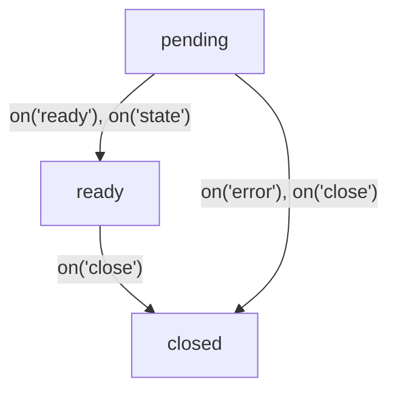

# @flinbein/stateful-rpc

A lightweight TypeScript library for type-safe Remote Procedure Calls (RPC) with built-in state management. This library facilitates communication between client and server with a focus on maintaining state synchronization.

## Installation

```bash
npm install @flinbein/stateful-rpc
```

## Features

- Type-safe RPC communication
- State synchronization
- Event-based messaging system
- Nested channels support
- Promise-based API
- Based on Proxy for dynamic method handling
- Works with WebSockets, MessagePorts, and more

## Basic Usage

### Server Side

```typescript
import { RPCSource } from '@flinbein/stateful-rpc';
import ws from 'ws';

// Create an RPC source with methods and initial state
export const calculator = new RPCSource({
  add: (a, b) => a + b,
  subtract: (a, b) => a - b,
  multiply: (a, b) => a * b,
  divide: (a, b) => {
    if (b === 0) throw new Error("Division by zero");
    return a / b;
  }
}, "calculator");

// Create a WebSocket server
const wss = new ws.Server({ port: 8080 });

// Handle WebSocket connections
wss.on('connection', (socket) => {
  // Start the RPC service for this connection
  RPCSource.start(calculator, (send, close) => {
    socket.on('message', (data) => {
      const message = JSON.parse(data.toString());
      send(...message);
    });
    
    socket.on('close', () => close('Connection closed'));
    
    return (...args) => {
      socket.send(JSON.stringify(args));
    };
  });
});
```

### Client Side

```typescript
import { RPCChannel } from '@flinbein/stateful-rpc';
import type { calculator } from './server'; // Import the type of the server-side RPCSource

// Connect to WebSocket server
const socket = new WebSocket('ws://localhost:8080');

// Create message handler
const wsWrapper = (socket) => (send, close) => {
  socket.onmessage = (event) => {
    const message = JSON.parse(event.data);
    send(...message);
  };
  
  socket.onclose = () => close('Connection closed');
  
  return (...args) => {
    socket.send(JSON.stringify(args));
  };
};

// Initialize RPC channel when WebSocket is ready
socket.onopen = async () => {
  const channel = new RPCChannel<typeof calculator>(wsWrapper(socket));
  
  try {
    // Wait for channel to be ready
    await channel.promise;
    
    // Call remote methods
    const sum = await channel.add(5, 3);
    console.log('5 + 3 =', sum); // 8
    
    const product = await channel.multiply(4, 7);
    console.log('4 * 7 =', product); // 28
    
    // Access the state
    console.log('State:', channel.state); // "calculator"
    
    // Listen for state changes
    channel.on('state', (newState, oldState) => {
      console.log(`State changed from ${oldState} to ${newState}`);
    });
  } catch (error) {
    console.error('Channel error:', error);
  }
};
```

## Working with State

The RPCSource maintains a state that can be accessed by clients. When the state changes, all connected clients are notified.

### Server Side

```typescript
import { RPCSource } from '@flinbein/stateful-rpc';

// Create a counter service with initial state of 0
const counter = new RPCSource({
  increment: function() {
    // Use setState to update the state
    this.setState((state) => state + 1);
    return this.state;
  },
  decrement: function() {
    this.setState((state) => state - 1);
    return this.state;
  }
}, 0); // Initial state is 0
```

### Client Side

```typescript
// Create and initialize the channel
const channel = new RPCChannel(wsWrapper(socket));
await channel.promise;

// Get the current state
console.log('Current count:', channel.state); // 0

// Listen for state changes
channel.on('state', (newState, oldState) => {
  console.log(`Counter changed from ${oldState} to ${newState}`);
});

// Increment the counter
const newValue = await channel.increment();
console.log('New count:', newValue); // 1
console.log('State is synchronized:', channel.state === newValue); // true
```

## Nested Channels

RPCSource allows you to create nested channels for more complex applications.

### Server Side

```typescript
import { RPCSource } from '@flinbein/stateful-rpc';

// Create an inner source
const userDetails = new RPCSource({
  updateName: function(name) {
    this.setState({ ...this.state, name });
    return this.state;
  },
  updateEmail: function(email) {
    this.setState({ ...this.state, email });
    return this.state;
  }
}, { name: "Guest", email: "" });

// Create a main source that provides access to the inner source
const mainService = new RPCSource({
  getUser: () => userDetails
});

// Start the RPC service with the main source
RPCSource.start(mainService, wsWrapper(socket));
```

### Client Side

```typescript
// Create the main channel
const mainChannel = new RPCChannel(wsWrapper(socket));

// Create a nested channel
const userChannel = new mainChannel.getUser();
await userChannel.promise;

// Access the nested channel's state
console.log('User:', userChannel.state); // { name: "Guest", email: "" }

// Update user information
await userChannel.updateName("John Doe");
console.log('Updated user:', userChannel.state); // { name: "John Doe", email: "" }

// Listen for state changes on the nested channel
userChannel.on('state', (newState) => {
  console.log('User updated:', newState);
});
```

## Custom Events

RPCSource provides a powerful event system that allows the server to emit events to connected clients.

### Server Side

```typescript
import { RPCSource } from '@flinbein/stateful-rpc';

// Define the event types using TypeScript
export const notificationService = new RPCSource({}).withEventTypes<{
  alive: [aliveSignal: boolean],
  alert: {
    warning: [message: string, level: number],
    error: [code: string, message: string]
  }
}>();

// Later, emit events to all connected clients
notificationService.emit("alive", true);
notificationService.emit(["alert", "warning"], "System maintenance soon", 2);
notificationService.emit(["alert", "error"], "ERR_001", "Connection lost");
```

### Client Side

```typescript
const channel = new RPCChannel<typeof notificationService>(wsWrapper(socket));

// Listen for custom events
channel.on("alive", (aliveSignal) => {
  console.log(`notificationService is alive: ${aliveSignal}`);
});

// Listen for nested events using dot notation
channel.alert.on("warning", (message, level) => {
  console.log(`Warning (level ${level}): ${message}`);
});

// Or use array path for nested events
channel.on(["alert", "error"], (code, message) => {
  console.log(`Error ${code}: ${message}`);
});
```
Reserved event names: `state`, `close`, `error`, `ready`.\
But you can use them as an array path:
```typescript
channel.on(['state'], (event) => {
  // this is a custom event named "state", not the built-in state event.
  console.log(event);
});
```

## Class-Based RPCSource

You can use class-based approach with method prefixes:

```typescript
// Using static helper method
class Calculator extends RPCSource.with("$") {
  // Prefix is automatically recognized
  $multiply(this: undefined, a: number, b: number) {
    return a * b;
  }
  
  $divide(this: undefined, a: number, b: number) {
    if (b === 0) throw new Error("Division by zero");
    return a / b;
  }
}

const rpcCalculator = new Calculator();
RPCSource.start(rpcCalculator, wsWrapper(socket))

// Client-side
const calculator = new RPCChannel<Calculator>(wsWrapper(socket));
const result = await calculator.multiply(5, 3); // Calls $multiply on the server
```

## Using with MessagePort

The library works seamlessly with Web Workers and MessagePorts:

```typescript
// Server side (Web Worker)
import { RPCSource } from '@flinbein/stateful-rpc';

const calculator = new RPCSource({
  add: (a, b) => a + b,
  subtract: (a, b) => a - b
});

self.onmessage = (event) => {
  const port = event.data;
  RPCSource.start(calculator, (send, close) => {
    port.onmessage = (messageEvent) => {
      send(...messageEvent.data);
    };
    port.start();
    return (...args) => {
      port.postMessage(args);
    };
  });
};
```

```typescript
// Client side
import { RPCChannel } from '@flinbein/stateful-rpc';

const worker = new Worker('calculator-worker.js');
const messageChannel = new MessageChannel();

worker.postMessage(messageChannel.port1, [messageChannel.port1]);

const channel = new RPCChannel((send) => {
  messageChannel.port2.onmessage = (event) => {
    send(...event.data);
  };
  messageChannel.port2.start();
  return (...args) => {
    messageChannel.port2.postMessage(args);
  };
});

const result = await channel.add(5, 3);
console.log(result); // 8
```

## Context in RPC Methods

You can provide a context object when starting the RPC service:

```typescript
// Server side
const users = new Map();

const userService = new RPCSource({
  // 'this' will be the context object (socket)
  setName: function(this: WebSocket, name: string) {
    users.set(this, name);
    return true;
  },
  getName: function(this: WebSocket) {
    return users.get(this);
  }
});

// Provide the socket as context
wss.on('connection', (socket) => {
  RPCSource.start(userService, wsWrapper(socket), {context: socket});
});
```

## Channel Lifecycle



### Pending
The channel is being established.
- `channel.ready` is `false`.
- `channel.closed` is `false`.
- `channel.promise` is pending.
- `channel.state` is `undefined`.
- You can use remote methods and nest channels.

### Ready
The channel is established and ready for communication.
- `channel.ready` is `true`.
- `channel.closed` is `false`.
- `channel.promise` is resolved with the channel instance.
- `channel.state` contains the current state from the server.
- You can use remote methods and nest channels.

### Closed
The channel is closed and cannot be used anymore.
- `channel.ready` is `false`.
- `channel.closed` is `true`.
- `channel.promise` is resolved or rejected with the close reason.
- `channel.state` contains the last known state from the server.
- You cannot use remote methods or nest channels.

### Events
Channels have lifecycle events that you can listen to:

```typescript
const channel = new RPCChannel(wsWrapper(socket));

// Listen for channel ready event
channel.on('ready', () => {
  console.log('Channel is ready!');
  console.assert(channel.ready === true);
});

// Listen for channel close event
channel.on('close', (reason) => {
  console.log('Channel closed with reason:', reason);
  console.assert(channel.closed === true);
});

// Listen for channel error event
channel.on('error', (error) => {
  console.error('Channel error:', error);
});

// Wait for channel to be ready
try {
  await channel.promise;
  console.log('Channel is ready!');
} catch (error) {
  console.error('Failed to establish channel:', error);
}
```

## API Reference

### RPCSource

The server-side component that handles remote procedure calls.

#### Constructor

```typescript
new RPCSource(methods, initialState = undefined)
```

- `methods`: An object with methods
- `initialState`: Optional initial state

#### Methods

- `setState(newState)`: Updates the state and notifies all clients
- `emit(event, ...args)`: Emits an event to all connected clients
- `dispose(reason?)`: Closes all connections and disposes the source
- `withState<S>(state?)`: Sets a new state type and optionally a new state value
- `withEventTypes<E>()`: Sets a new events type

#### Static Methods

- `start(rpcSource, handler, options?)`: Starts handling RPC for a connection
- `validate(validator, handler)`: Creates a function with argument validation
- `with(methods?, state?)`: Creates a new RPCSource subclass

### RPCChannel

The client-side component that communicates with an RPCSource.

#### Constructor

```typescript
new RPCChannel(handler, options?)
```

- `handler`: A function that handles message sending and receiving
- `options`: Configuration options
  - `getNextChannelId`: Function to generate unique channel IDs

#### Properties

- `state`: The current state received from the server
- `closed`: Whether the channel is closed
- `ready`: Whether the channel is ready for communication
- `promise`: A promise that resolves when the channel is ready

#### Methods

- `close(reason?)`: Closes the channel
- `on(event, handler)`: Adds an event listener
- `once(event, handler)`: Adds a one-time event listener
- `off(event, handler)`: Removes an event listener

## License

MIT
