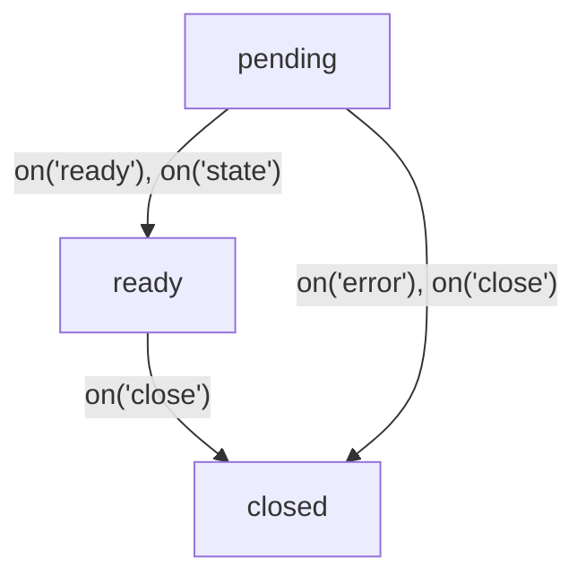

# @flinbein/stateful-rpc

A lightweight TypeScript library for type-safe Remote Procedure Calls (RPC) with built-in state management. This library facilitates communication between client and server with a focus on maintaining state synchronization.

**Features:**
- Type-safe RPC communication
- State synchronization
- Event-based messaging system
- Nested channels support
- Promise-based API
- Based on Proxy for dynamic method handling
- Works with WebSockets, MessagePorts, and more

## Table of Contents

- [Installation](#installation)
- [Basic Usage with WebSockets](#basic-usage-with-websockets)
- [Channel Lifecycle](#channel-lifecycle)
- [Builtin Events](#builtin-events)
- [Calling Remote Methods](#calling-remote-methods)
- [Working with State](#working-with-state)
- [Nested Channels](#nested-channels)
- [Custom Events](#custom-events)
- [Class-Based RPCSource](#class-based-rpcsource)
- [Context in RPC Methods](#context-in-rpc-methods)
- [API Reference](#api-reference)
- [Using with WebSocket](#using-with-websocket)
- [Using with SharedWorker](#using-with-sharedworker)
- [Using with Other Transports](#using-with-other-transports)
- [License](#license)

## Installation

```bash
npm install @flinbein/stateful-rpc
```

## Basic Usage with WebSockets

Server Side:
```typescript
import RPCSource from '@flinbein/stateful-rpc/source';
import ws from 'ws';

// Create an RPC source with methods
export const calculator = new RPCSource({
  add: (a, b) => a + b,
  subtract: (a, b) => a - b,
  multiply: (a, b) => a * b,
  divide: (a, b) => {
    if (b === 0) throw "Division by zero";
    return a / b;
  }
});

// Create a connection handler for WebSocket
function createConnection(socket) {
  return (send, close) => {
    // Handle incoming messages from the WebSocket
    socket.on("message", (data) => {
      send(...JSON.parse(data.toString()));
    });
  
    // Handle WebSocket closure
    socket.on("close", () => close("Client disconnected"));

    // Return a function to send messages back to the client
    return (...args) => socket.send(JSON.stringify(args));
  };
}

// Create a WebSocket server
const wss = new ws.Server({ port: 8080 });

// Handle WebSocket connections
wss.on('connection', (socket) => {
  // Start the RPC service for this connection
  RPCSource.start(calculator, createConnection(socket));
});
```
Client Side:
```typescript
import RPCChannel from '@flinbein/stateful-rpc/channel';

// Import the type of the server-side RPCSource
import type { calculator } from './server'; 

// Create a connection handler for WebSocket
function createConnection(socket: WebSocket){
  return (send, close) => {
    socket.onmessage = (event) => {
      send(...JSON.parse(event.data));
    };
    
    socket.onclose = () => close('Connection closed');
    
    return (...args) => socket.send(JSON.stringify(args));
  };
}

// Connect to WebSocket server
const socket = new WebSocket('ws://localhost:8080');

// wait for the WebSocket to open before using the RPC channel
await new Promise(resolve => socket.onopen = resolve);

const sum = await channel.add(5, 3);
console.log('5 + 3 =', sum); // 8

const product = await channel.multiply(4, 7);
console.log('4 * 7 =', product); // 28

try {
  await channel.divide(10, 0);
} catch (e) {
  console.error('Error:', e); // "Division by zero"
}

channel.close();
```

## Channel Lifecycle



### Pending
The channel is being established.
- `channel.ready` is `false`.
- `channel.closed` is `false`.
- `channel.promise` is pending.
- `channel.state` is `undefined` (not available yet).
- You can use remote methods and nest channels. But they can throw exception if the channel is closed.

### Ready
The channel is established and ready for communication.
- `channel.ready` is `true`.
- `channel.closed` is `false`.
- `channel.promise` is resolved with the channel instance.
- `channel.state` contains the current state from the server.
- You can use remote methods and nest channels.

### Closed
The channel is closed and cannot be used anymore.
- `channel.ready` is `false`.
- `channel.closed` is `true`.
- `channel.promise` is resolved or rejected with the close reason.
- `channel.state` contains the last known state from the server.
- You cannot use remote methods or nest channels.

## Builtin Events
Channels have lifecycle events that you can listen to:

```typescript
const channel = new RPCChannel(messageHandler);

// Listen for channel ready event
channel.on('ready', () => {
  console.log('Channel is ready!');
  console.assert(channel.ready === true);
});

// Listen for channel close event
channel.on('close', (reason) => {
  console.log('Channel closed with reason:', reason);
  console.assert(channel.closed === true);
});

// Listen for channel error event
channel.on('error', (error) => {
  console.error('Channel error:', error);
});

// Wait for channel to be ready
try {
  await channel.promise;
  console.log('Channel is ready!');
} catch (error) {
  console.error('Failed to establish channel:', error);
}
```

## Calling Remote Methods
Server side:
```typescript
export const mathService = new RPCSource({
  ping: () => "pong",
  logToServer: (...message) => console.log("Message from client:", ...message),
  math: { // you can nest methods
    square: (x) => x * x,
  },
});

RPCSource.start(mathService, connection);
```
Client side:
```typescript
const channel = new RPCChannel<typeof mathService>(connection);
// call method
console.log(await channel.ping()); // "pong"
// call nested method
console.log(await channel.math.square(5)); // 25
// call method without waiting for a response
channel.logToServer.notify("hello from client"); // void
```

Be aware that `this` in RPCSource methods is `undefined` by default.
You can change it by providing a context object when starting the RPC service.

## Working with State

The RPCSource maintains a state that can be accessed by clients.
When the state changes, all connected clients are notified.

### Server Side

```typescript
export const counter = new RPCSource({
  increment: () => {
    // Use counter.setState to update the state
    counter.setState((state) => state + 1);
    return counter.state;
  },
  decrement: () => {
    counter.setState((state) => state - 1);
    return counter.state;
  }
}, 0); // Initial state is 0
// on socket connection
RPCSource.start(counter, connection);
```

### Client Side

```typescript
const channel = new RPCChannel<typeof counter>(connection);

// Get the current state
console.log('Current count:', channel.state); // 0

// Listen for state changes
channel.on('state', (newState, oldState) => {
  console.log(`Counter changed from ${oldState} to ${newState}`);
});

// Increment the counter
console.log('New count:', await channel.increment()); // 1
console.log('State is synchronized:', channel.state === 1); // true
```

## Nested Channels

RPCSource allows you to create nested channels for more complex applications.

### Server Side

```typescript
const userDetails = new RPCSource({
  updateName: (name) => {
    userDetails.setState({ ...this.state, name });
    return userDetails.state;
  },
  updateEmail: (email) => {
    userDetails.setState({ ...this.state, email });
    return userDetails.state;
  }
}, { name: "Guest", email: "" });

// Create a main source that provides access to the inner source
export const mainService = new RPCSource({
  getUser: () => userDetails
});

// Start the RPC service with the main source
RPCSource.start(mainService, connection);
```

### Client Side

```typescript
// Create the main channel
const mainChannel = new RPCChannel<typeof mainService>(connection);

// Create a nested channel
const userChannel = new mainChannel.getUser();

// Access the nested channel's state
console.log('User:', userChannel.state); // { name: "Guest", email: "" }

// Update user information
await userChannel.updateName("John Doe");
console.log('Updated user:', userChannel.state); // { name: "John Doe", email: "" }
```

## Custom Events

RPCSource provides a powerful event system that allows the server to emit events to connected clients.

### Server Side

```typescript
import RPCSource from '@flinbein/stateful-rpc/source';

// Define the event types using TypeScript
export const notificationService = new RPCSource({}).withEventTypes<{
  alive: [aliveSignal: boolean],
  alert: { // you can use nested events
    warning: [message: string, level: number],
    error: [code: string, message: string]
  }
}>();

// Start the RPC service with the main source
RPCSource.start(notificationService, connection);

// Later, emit events to all connected clients
notificationService.emit("alive", true);
notificationService.emit(["alert", "warning"], "System maintenance soon", 2);
notificationService.emit(["alert", "error"], "ERR_001", "Connection lost");

```

### Client Side

```typescript
const channel = new RPCChannel<typeof notificationService>(connection);

// Listen for custom events
channel.on("alive", (aliveSignal) => {
  console.log(`notificationService is alive: ${aliveSignal}`);
});

// Listen for nested events using dot notation
channel.alert.on("warning", (message, level) => {
  console.log(`Warning (level ${level}): ${message}`);
});

// Or use array path for nested events
channel.on(["alert", "error"], (code, message) => {
  console.log(`Error ${code}: ${message}`);
});
```
Reserved event names: `state`, `close`, `error`, `ready`.\
But you can use them as an array path:
```typescript
// server
source.emit("state", "custom state event", 123);
// client
channel.on(['state'], (...eventData) => {
  // this is a custom event named "state", not the built-in state event.
  console.log(...eventData); // "custom state event" 123
});
```

## Class-Based RPCSource

You can use class-based approach with method prefixes:

```typescript
class Calculator extends RPCSource.with("$") {
  // Prefix is automatically recognized
  $multiply(this: undefined, a: number, b: number) {
    return a * b;
  }
  
  $divide(this: undefined, a: number, b: number) {
    if (b === 0) throw new Error("Division by zero");
    return a / b;
  }
}
const rpcCalculator = new Calculator();

RPCSource.start(rpcCalculator, connection);

// Client-side
const calculator = new RPCChannel<Calculator>(connection);
const result = await calculator.multiply(5, 3); // Calls $multiply on the server
```
All methods prefixed with `$` will be exposed as remote methods.

## Context in RPC Methods

You can provide a context object when starting the RPC service:

```typescript
// Server side
const users = new Map();

const userService = new RPCSource({
  // 'this' will be the context object (socket)
  setName: function(this: WebSocket, name: string) {
    users.set(this, name);
    return true;
  },
  getName: function(this: WebSocket) {
    return users.get(this);
  }
});

// Provide the socket as context
wss.on('connection', (socket) => {
  RPCSource.start(userService, wsWrapper(socket), {context: socket});
});
```

## API Reference

### RPCSource

The server-side component that handles remote procedure calls.

#### Constructor

```typescript
new RPCSource(methods, initialState = undefined)
```
| Constructor Parameter | Type                | Description                          |
|-----------------------|---------------------|--------------------------------------|
| `methods`             | object with methods | methods               |
| `initialState`        | `<T>`                 | Optional initial state               |

#### Methods
| Method                | Description                                                                                                                                     |
|-----------------------|-------------------------------------------------------------------------------------------------------------------------------------------------|
| `setState(newState)`  | Updates the state and notifies all clients. <br/> You can pass a value or a function that receives the current state and returns the new state. |
| `emit(event, ...args)`| Emits an event to all connected clients                                                                                                         |
| `dispose(reason?)`    | Closes all connections and disposes the source                                                                                                  |
| `withState<S>(state?)`| Sets a new state type and optionally a new state value                                                                                          |
| `withEventTypes<E>()` | Sets a new events type                                                                                                                          |

#### Static Methods
| Method                                   | Description                                                                             |
|------------------------------------------|-----------------------------------------------------------------------------------------|
| `start(rpcSource, connection, options?)` | Starts the RPC service with the given source.<br/> Returns a function to close all channels. |

#### Properties

| Property            | Type      | Description                    |
|---------------------|-----------|--------------------------------|
| readonly `state`    | `<T>`     | The current state              |
| readonly `disposed` | `boolean` | Whether the source is disposed |

### RPCChannel

The client-side component that communicates with an RPCSource.

#### Constructor

```typescript
new RPCChannel(handler, options?)
```
| Constructor Parameters       | Type                  | Description                                                                                |
|------------------------------|-----------------------|--------------------------------------------------------------------------------------------|
| `handler`                    | `Function`            | A function that handles message sending and receiving                                      |
| `options?`                   | `object`              | Configuration options                                                                      |
| `options.getNextChannelId?`  | `Function`            | Function to generate unique channel IDs                                                    |
| `options.connectionTumeout?` | `number\|AbortSignal` | Timeout for establishing the connection.<br/> Channel will be closed if not ready in time. |

#### Properties

| Property  | Type            | Description                                       |
|-----------|-----------------|---------------------------------------------------|
| `state`   | `<T>`           | The current state from the server                 |
| `closed`  | `boolean`       | Whether the channel is closed                     |
| `ready`   | `boolean`       | Whether the channel is ready                      |
| `promise` | `Promise<this>` | A promise that resolves when the channel is ready |
| `then`    | `undefined`     | Reserved                                          |

#### Methods
| Method                 | Description                                                               |
|------------------------|---------------------------------------------------------------------------|
| `close(reason?)`       | Closes the channel                                                        |
| `on(event, handler)`   | Adds an event listener                                                    |
| `once(event, handler)` | Adds a one-time event listener                                            |
| `off(event, handler)`  | Removes an event listener                                                 |
| `*(...args)`           | Proxy-based methods to call remote methods                                |
| `*.notify(...args)`    | Proxy-based methods to call remote methods without waiting for a response |

#### Events
| Event     | Parameters                | Description                                                                                 |
|-----------|---------------------------|---------------------------------------------------------------------------------------------|
| `"close"` | [`reason`]                | Emitted when the channel is closed. Handler receives the close reason.                      |
| `"error"` | [`reason`]                | Emitted when an error occurs. Handler receives the error object.                            |
| `"ready"` | [ ]                       | Emitted when the channel is ready.                                                          |
| `"state"` | [`newState`, `oldState?`] | Emitted when the state changes. Handler receives the new state and old state (if available) | 
| `*`       | [...`*`]                  | Custom events defined in the RPCSource. Handler receives event arguments.                   |
| `[...*]`  | [...`*`]                  | Nested custom events. Handler receives event arguments.                                     |


## Using with WebSocket

A simple example of using the library with a WebSocket server and client using the `ws` library.

Server:
```typescript
import ws from "ws";
import { RPCSource } from "@flinbein/stateful-rpc";

// Create an RPC source with methods and initial state
export const rpcSource = new RPCSource({
    ping: () => "pong",
    echo: (msg) => msg,
});

function createConnection(socket) {
  return (send, close) => {
    // Handle incoming messages from the WebSocket
    socket.on("message", (data) => {
      send(...JSON.parse(data.toString()));
    });
  
    // Handle WebSocket closure
    socket.on("close", () => close("Client disconnected"));

    // Return a function to send messages back to the client
    return (...args) => {
      socket.send(JSON.stringify(args));
    };
  };
}

const wss = new ws.Server({ port: 8080 });

wss.on("connection", (socket) => {
  RPCSource.start(rpcSource, createConnection(socket), {context: socket});
});
```
Client:
```typescript
import { RPCChannel } from "@flinbein/stateful-rpc";
import type { rpcSource } from "./backend";

function createConnection(socket: WebSocket) {
  return (send, close) => {
    socket.onmessage = (event) => {
      send(...JSON.parse(event.data));
    };
    socket.onclose = () => close("Connection closed");
    return (...args) => {
      socket.send(JSON.stringify(args));
    };
  };
}

// Connect to WebSocket server
const socket = new WebSocket("ws://localhost:8080");

// Wait for the WebSocket to open before using the RPC channel
await new Promise(resolve => socket.onopen = resolve);

// Create RPC channel
const rpc = new RPCChannel<typeof rpcSource>(createConnection(socket));

// Use the RPC channel
console.log(await rpc.ping()); // "pong"
console.log(await rpc.echo("Hello, World!")); // "Hello, World!"
```
You can implement message serialization in the `wsWrapper` function as you see fit.
This example uses JSON, which limits the types of data that can be transmitted.

## Using with SharedWorker

SharedWorker:
```typescript
import RPCSource from "@flinbein/stateful-rpc/source";

const source = new RPCSource({
  broadcast: (eventName: string, ...args: any) => {
    void source.emit(eventName, ...args)
  },
  setState: (value: any) => void source.setState(value)
});

function createConnection(port: MessagePort) {
  return (send: Function, close: Function) => {
    port.addEventListener("message", (event) => {
      const [type, ...args] = event.data;
      if (type === "message") return send(...args);
      if (type === "close") return close(args[0]);
    });
    port.start();
    return (...args: any[]) => port.postMessage(["message", ...args]);
  }
}

onconnect = (event: MessageEvent) => {
  const port = event.ports[0];
  RPCSource.start(source, createConnection(port), {context: port});
  port.start();
  port.postMessage(["ready"]);
}

console.log("=== SharedWorker done");

export { type source };
```
Client:
```typescript
import RPCChannel from "@flinbein/stateful-rpc/channel";
import type { source } from "./sharedWorker.js"

function createConnection(port: MessagePort) {
  return (send: Function, close: Function) => {
    port.addEventListener("message", (event) => {
      const [type, ...args] = event.data;
      if (type === "message") return send(...args);
      if (type === "close") return close(args[0]);
    });
    // cleanup connection on unload
    window.addEventListener("beforeunload", () => {
      port.postMessage(["close", "closed by unload"]);
    })
    return (...args: any[]) => port.postMessage(["message", ...args]);
  }
}

const sharedWorker = new SharedWorker("./sharedWorker.js", { type: "module" });

// wait for ready
await new Promise(resolve => {
  const abortMessageListenerCtrl = new AbortController();
  sharedWorker.port.addEventListener("message", (event: MessageEvent) => {
    if (event.data[0] !== "ready") return;
    abortMessageListenerCtrl.abort();
    resolve(true);
  }, {signal: abortMessageListenerCtrl.signal});
  sharedWorker.port.start();
})

const channel = new RPCChannel<typeof source>(createConnection(sharedWorker.port));

// work with channel in different tabs:
channel.on("chatMessage", (from, message) => {
  console.log(`[${from}]: ${message}`);
});
channel.broadcast.notify("chatMessage", "Me", "Hello!");
await channel.setState("new-shared-state");

port.postMessage(["close", "closed by user"]);
port.close();
```

## Using with Other Transports

You can use the library with any transport that can send and receive messages as arrays. You need to implement a wrapper function that takes `send` and `close` functions and returns a `sendToRemote` function.
```typescript
new RPCChannel((send, close) => {
  return sendToRemote;
});
```
* You should call `send(...args)` when receiving a message intended for the RPCChannel.
* You should call `close(reason?)` when the connection is broken. In this case, the current channel and all its child channels will be closed with the specified reason.
* You should return a `sendToRemote(...args)` function that will send messages to the server.

You can additionally specify a `getNextChannelId` function in the RPCChannel constructor options to generate channel IDs.
They should be unique for each channel within a single connection.
This will reduce the size of messages as channel IDs will be smaller.
```typescript
let i = 0;
new RPCChannel((send, close) => {/*...*/}, {
  getNextChannelId: () => i++
});
```
On the server side, the wrapper is created in a similar way:
```typescript
RPCSource.start(rpcSource, (send, close) => {
  return sendToRemote;
});
```
You can specify the maximum number of channels that can be created by the client.
You can also specify a context that will be available in RPCSource methods via `this`.
```typescript
const closeAllChannels = RPCSource.start(rpcSource, (send, close) => {...}, {
  maxChannelsPerClient: 1000, // default is Infinity
  context: socket
});
```
You can call `closeAllChannels(reason?)` to close all channels associated with this connection.

## License

MIT
