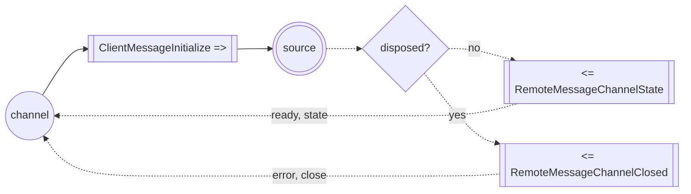
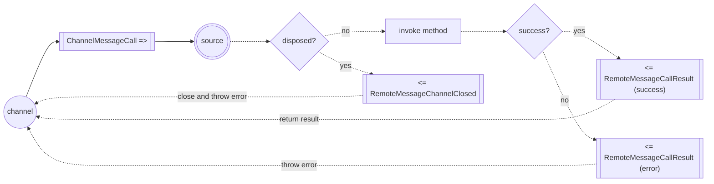
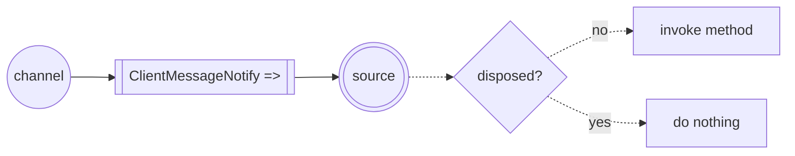
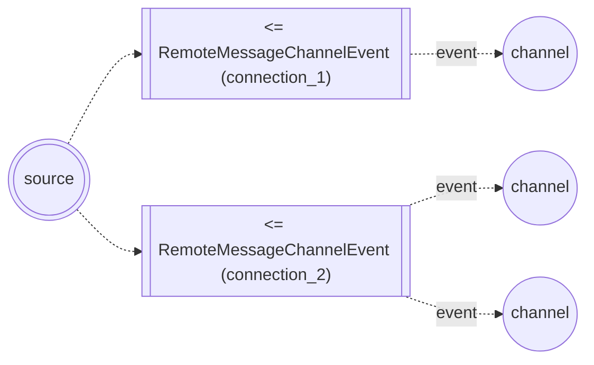
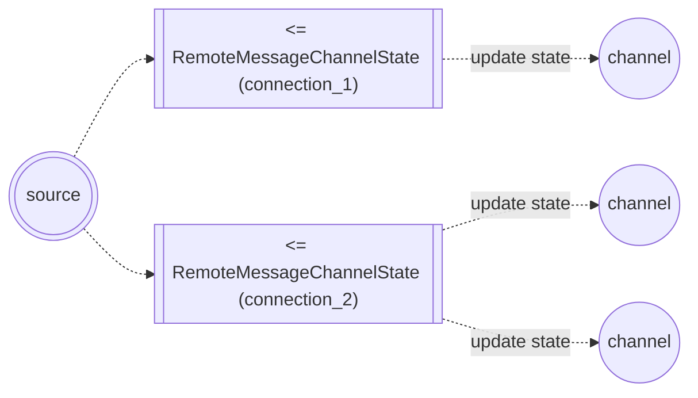
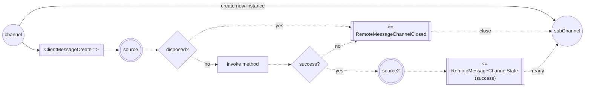
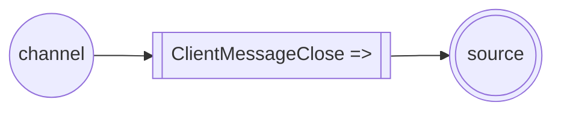
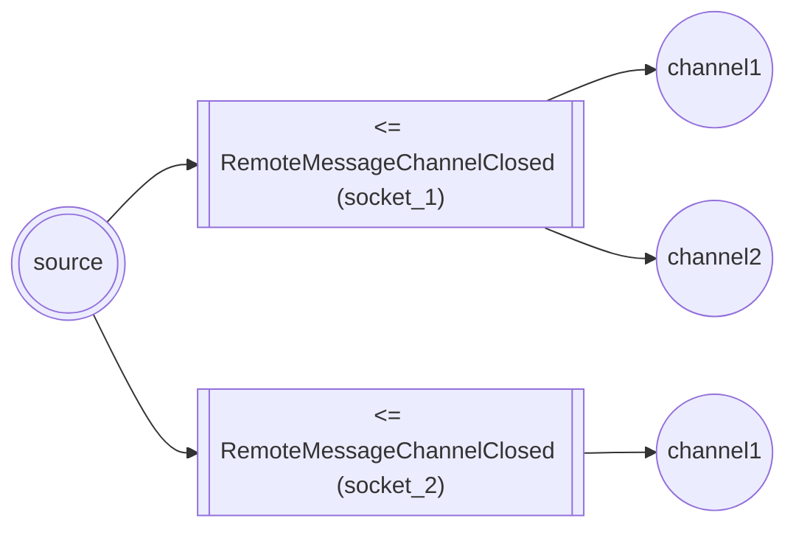

# RPC Contract

---

## Initialization

When created, RPCChannel sends a ClientMessageInitialize packet.
This packet will be processed by the RPCSource object, and a new channel will be created.
```typescript
const channel = new RPCChannel(...)
```

Depending on the response, RPCClient will transition to either the `ready` or `closed` state.

## Method Call
```typescript
await channel.someMethod(...args);
```
When a method is called, RPCClient sends a `ChannelMessageCall` packet.
This packet will be processed by the RPCSource object, and the corresponding method will be invoked.
* If the method doesn't exist, RPCSource will send a `RemoteMessageCallResult` packet with an error.
* If the method executes successfully, RPCSource will send a `RemoteMessageCallResult` packet with the result.
* If the method throws an error, RPCSource will send a `RemoteMessageCallResult` packet with the error.
* If the channel was closed, RPCSource will send a `RemoteMessageChannelClosed` packet.


## Method Call Without Waiting for Result
```typescript
await channel.someMethod.notify(...args);
```
When calling a method using notify, RPCClient sends a `ClientMessageNotify` packet.
This packet will be processed by the RPCSource object, and the corresponding method will be invoked without waiting for a response.


## Receiving Events
```typescript
rpcSource.emit("someEvent", ...args);
client.on("someEvent", (...args) => { /*...*/ });
```
RPCSource can send events using the `RemoteMessageChannelEvent` packet for all connections.


## Receiving state updates
```typescript
rpcSource.setState((oldState) => newState);
client.on("state", (...args) => { /*...*/ });
```
RPCSource can send state updates using the `RemoteMessageChannelState` packet for all connections.


## Creating a New Channel
```typescript
const subChannel = new channel.SubChannel(...args);
```
When creating a child channel, RPCChannel sends a ClientMessageCreate packet.
RPCSource must then invoke an internal method that returns another RPCSource object.
* If the method is called successfully, RPCSource will send a `RemoteMessageChannelState` packet, which will transition the child channel to the `ready` state and set its `state` value.
* If the method throws an error, or the channel was closed, RPCSource will send a `RemoteMessageChannelClosed` packet, which will close the child channel.


## Closing a Channel from the Client Side
```typescript
channel.close(reason);
```
RPCChannel sends a `ClientMessageClose` packet.
RPCSource must then close the channel and free resources.

The server does not send a response to this message.

## Closing a Channel from the Server Side
```typescript
source.dispose(reason);
```
RPCSource sends a `RemoteMessageChannelClosed` packet to all connected RPCChannel instances.
When possible, RPCSource will group data for a single communication channel.

After this procedure, RPCSource will always reject new connections.

## Client to Server Messages

### Initialize RPC
```typescript
type ClientMessageInitialize = [
  channelId: number|string,
]
```
Handler will respond with:
* [RemoteMessageChannelState](#channel-created-or-state-updated) on success
* [RemoteMessageChannelClosed](#channel-closed) on error

### Call Remote Method
```typescript
type ChannelMessageCall = [
  channelId: number|string,
  action: CLIENT_ACTION.CALL, // 0
  responseKey: any, // server will respond with this key
  path: string[], // path to remote function
  arguments: any[] // call function with these arguments  
]
```
Handler will respond with:
* [RemoteMessageCallResult](#method-call-result) if channel exists.
* [RemoteMessageChannelClosed](#channel-closed) if channel is closed or does not exist.

### Notify
```typescript
type ClientMessageNotify = [
  channelId: number|string,
  action: CLIENT_ACTION.NOTIFY, // 3
  path: string[], // path to remote function
  arguments: any[] // call function with these arguments  
]
```
No response for this message, even if the handler throws an exception.

### Close Channel
```typescript
type ClientMessageClose = [
  channelId: number|string,
  action: CLIENT_ACTION.CLOSE, // 1
  reason: any
]
```
No response is expected from the handler.

### Create New Channel
```typescript
type ClientMessageCreate = [
  channelId: number|string,
  action: CLIENT_ACTION.CREATE, // 2 
  newChannelId: number, // server will respond with this key
  path: string[], // path to remote constructor
  arguments: any[] // call constructor with these arguments   
]
```
Handler will respond with:
* [RemoteMessageChannelState](#channel-created-or-state-updated) on success
* [RemoteMessageChannelClosed](#channel-closed) on error

---

## Server to Client Messages

### Method Call Result
```typescript
type RemoteMessageCallResult = [
  channelId: (number|string)[],
  action: REMOTE_ACTION.RESPONSE_OK | REMOTE_ACTION.RESPONSE_ERROR, // 0 | 3
  responseKey: any, // from ChannelMessageCall
  result: any, // result of function call or error
]
```

### Channel Closed
Note: The default channel cannot be closed.
```typescript
type RemoteMessageChannelClosed = [
  channelId: (number|string)[],
  action: REMOTE_ACTION.CLOSE, // 1
  closeReason: any, // reason for closing
]
```

### Channel Created or State Updated
```typescript
type RemoteMessageChannelState = [
  channelId: (number|string)[],
  action: REMOTE_ACTION.STATE, // 2 
  state: any, // state value of channel
]
```

### Channel Emit Event
```typescript
type RemoteMessageChannelEvent = [
  channelId: (number|string)[],
  action: REMOTE_ACTION.EVENT, // 4
  eventPath: string[], // path to subscriber, event name included
  eventData: any[]
]
```